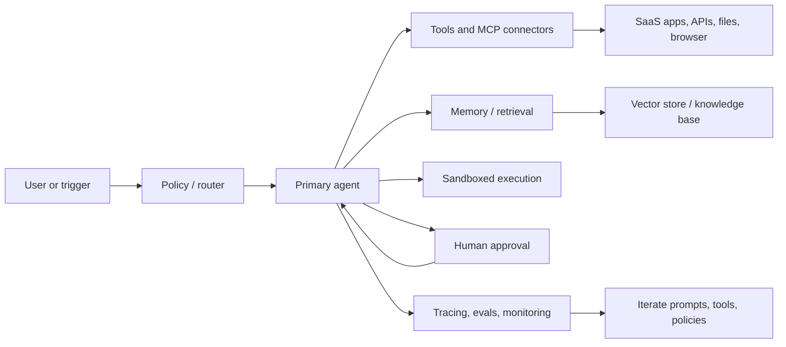

# Agentic AI Startup Cheat Sheet

The strongest founders are no longer treating agentic AI as “chat with tools”. They are picking narrow, high-frequency workflows with measurable ROI, wiring models into real systems, keeping architectures simpler than the hype suggests, and investing heavily in context, evals, approvals, and deployment discipline. The best near-term wedges are software development, customer support, legal workflows, and enterprise search/knowledge work, because these domains have structured tasks, clear success metrics, existing budgets, and natural human off-ramps. The commercial pattern is also becoming clearer: fast product-led adoption in developer tools, services-assisted enterprise rollout in workflow products, and a long-term ambition to become the customer’s system of work or system of record. citeturn26view0turn21view0turn21view2turn23view1turn19view4turn20view0

## What the best founders believe now

- **Start with a wedge, not a general assistant.** The most credible opportunities are narrow workflows where output quality is observable and the buyer can prove savings or revenue lift: support, coding, legal, internal search, and parts of healthcare/ops. citeturn23view1turn19view3turn26view1
- **Prefer simple compositions over agent theatre.** Anthropic’s practical guidance is explicit: the strongest teams are using “simple, composable patterns”, and only using agents when tasks are open-ended enough that you cannot hard-code the path. citeturn26view0turn26view1
- **Context is the product.** Memory, connectors, permissions, MCP integration, retrieval, and stateful execution are what turn a model into a useful worker rather than a clever demo. citeturn26view11turn27view0turn27view2turn33view3
- **Reliability is the moat.** Production products win by running evals, constraining outputs, tracing behaviour, inserting human approvals, and hardening long-tail edge cases. citeturn21view0turn28view2turn28view3turn27view0
- **Go-to-market is often services-led first.** a16z’s thesis is that AI startups should accept implementation work and forward-deployed engineering early, because that is how they capture the workflow, data exhaust, and trust that later become software margins and switching costs. citeturn23view0turn21view4
- **Pricing is moving, but buyers are not uniform.** Founders like Sierra’s describe outcome/resolution-based pricing as incentive-aligned, but CIOs still say most buyers currently prefer usage pricing for AI applications until outcomes are consistently measurable and billable. citeturn19view5turn19view4turn20view0

## Market map

| Name | Category | Core offering | Why it matters | Links |
|---|---|---|---|---|
| entity["company","OpenAI","ai company"] | Platform / API | Responses API, built-in tools, Agents SDK, sandboxed execution | Strong default for hosted tool-using agents: one API for web, files, code, computer use, MCP, memory/state, and long-horizon agent harnesses. citeturn26view3turn26view4turn28view0turn28view1 | Official docs citeturn26view3turn26view4 |
| entity["company","Anthropic","ai lab"] | Model platform / thought leadership | Claude models, tool use, MCP ecosystem, strong agent design guidance | Important because Anthropic has set much of the practical design language for agents: simple patterns, trusted environments, human control, and governance. citeturn26view0turn26view1turn29view0turn29view1 | Official guides citeturn26view0turn29view0 |
| entity["company","Google Cloud","cloud platform"] | Enterprise agent platform | Gemini Enterprise Agent Platform, ADK, Agent Engine, Memory Bank | One of the most complete enterprise stacks: build, deploy, govern, evaluate, and add memory on a managed runtime with model choice and security controls. citeturn27view0turn27view1turn27view2 | Official docs citeturn27view0turn27view1 |
| entity["company","LangChain","llm framework"] / LangGraph | Orchestration | Stateful workflow/agent runtime with persistence, memory and observability | Highly relevant when you want explicit control over state, nodes, edges, memory and human-in-the-loop rather than a black-box agent loop. citeturn26view5turn26view6turn3search2 | Official docs citeturn26view5turn26view6 |
| entity["company","Microsoft","software company"] / AutoGen | Multi-agent framework | Event-driven framework for scalable conversational and multi-agent systems | Useful when the problem is genuinely multi-agent and distributed; stronger fit for research-y or enterprise multi-agent workflows than simple wrappers. citeturn26view7turn2search12 | Official docs citeturn26view7 |
| entity["company","CrewAI","agent framework"] | Multi-agent framework | Agents, crews and flows with guardrails, memory, knowledge and observability | Popular with teams that want production-oriented multi-agent automation and explicit flow orchestration. citeturn26view8 | Official docs citeturn26view8 |
| entity["company","Vercel","web platform"] / AI SDK | App layer SDK | TypeScript toolkit for AI apps and agents across providers | Important because it standardises provider integration and streaming for web products, making it easier to ship agentic UX fast. citeturn26view9turn2search11 | Official docs citeturn26view9 |
| entity["company","LlamaIndex","agent framework"] | Data / workflow framework | AgentWorkflow and Workflows for stateful agent systems | Strong fit where document-heavy or retrieval-heavy products need orchestration, state, hand-offs and real-time visibility. citeturn26view10turn33view3turn33view4 | Official docs citeturn26view10turn33view3 |
| entity["company","Modal","ai infrastructure"] | Compute / runtime infra | Serverless inference, sandboxes, batch and GPU infrastructure | Relevant for startups that need secure code execution, scalable inference and fast experimentation without building infra from scratch. citeturn33view1turn33view0 | Official docs citeturn33view1 |
| entity["company","Pinecone","vector database"] | Retrieval / memory infra | Vector search and agent-oriented retrieval patterns | Retrieval is not dead; it is becoming more agentic. Pinecone remains one of the most important pieces of external memory and grounding infrastructure. citeturn17search10turn17search6turn33view2 | Official docs citeturn33view2turn17search10 |
| entity["company","Sierra","customer ai startup"] | Agentic product company | Customer experience agents across support, voice and sales journeys | A reference company for outcome pricing and for moving from “support bot” to full customer-lifecycle agent platform. citeturn25view6turn35search0turn19view5 | Official site / blog citeturn25view6turn35search0 |
| entity["company","Harvey","legal ai startup"] | Agentic product company | Legal workflow platform with custom agents and workflow builder | One of the clearest proofs that a vertical workflow platform can move beyond assistant UX into end-to-end agent execution. citeturn25view0turn25view1turn9search0 | Official site / blog citeturn25view1turn25view0 |
| entity["company","Factory","software agent startup"] | Agentic product company | “Droids” for software-development work, plus shared engineering context | Important because it represents the shift from code autocomplete to delegated, long-running engineering work with monitoring and shared context. citeturn25view2turn25view3turn35search3 | Official site / blog citeturn25view2turn35search3 |
| entity["company","Decagon","customer ai startup"] | Agentic product company | AI concierge for customer support across chat, email and voice | Useful reference for what enterprise customer-service agents look like when sold with strong human-off-ramp and white-glove deployment. citeturn35search2turn35search5turn16search1 | Official site citeturn35search2 |
| entity["company","Dust","enterprise ai startup"] | Agentic product company | Internal company agents with data connectors, memory and MCP tooling | A good company to study for the “agents for knowledge work” layer: context-aware internal agents, memory, and organisation-wide deployment. citeturn24search8turn24search17turn11search17turn11search15 | Official site / product docs citeturn24search8turn24search17 |

## Builder stack and default architecture

The current best-practice stack is converging on five layers: **frontier model API**, **orchestration/state**, **tool/connectivity layer**, **external memory/retrieval**, and **runtime safety/observability**. The common mistake is jumping straight to a complex multi-agent graph; the better default is a single agent inside a deterministic workflow, with specialist sub-agents only when toolsets, approval boundaries, or evaluation logic genuinely differ. citeturn26view0turn26view3turn26view5turn27view0turn29view0

A practical default workflow for a new startup is: **OpenAI Responses or Anthropic for model/tool loop; LangGraph or LlamaIndex Workflows for stateful orchestration; Vercel AI SDK for product UX; Pinecone or hosted file search for grounding; and a secure runtime such as Modal or provider-managed sandboxes for code/tool execution**. Add MCP when you need a standard way to expose internal tools, but keep approvals on until you trust the permission model. citeturn26view3turn32view3turn26view5turn33view3turn26view9turn33view1turn28view3

## Business model, go-to-market and capital

The clearest commercial lesson is that **buyers purchase labour replacement or labour compression, not “AI”**. Customer support wins because the metrics are already there: tickets solved, resolution rate, CSAT, and cost-to-serve. Legal wins because the work is text-heavy and valuable. Coding wins because tests and benchmarks make quality legible. Search wins because every enterprise has fragmented knowledge systems. citeturn23view1turn20view0turn26view1

On pricing, the market is splitting. **Usage pricing is still what many CIOs prefer today**, especially where outcomes are messy to define or attribute. But in the highest-signal categories, founders are pushing toward **resolution-based or outcome-based pricing** because it better matches value and aligns incentives. Sierra is the canonical example; a16z’s CIO survey suggests the market likes the idea but still finds many outcome contracts hard to measure and budget. citeturn19view5turn19view4turn20view0

On go-to-market, the winning pattern is usually: **land with one painful workflow, deploy with heavy customer involvement, prove a hard ROI, then expand sideways into more workflows and deeper data ownership**. a16z argues that AI startups should tolerate lower early gross margins and more services work if that is what it takes to own the system of work and eventually become the system of record. It also argues that AI-native companies are simply growing faster, with “10x” year-on-year growth increasingly the new breakout bar. citeturn23view0turn21view1turn21view2

Funding has followed that logic. Enterprise AI budgets have moved from innovation funds into core IT and business-unit budgets; 37% of surveyed CIOs reported using five or more models in production; and agent startups dominated a remarkable share of early-stage formation, with PitchBook reporting that **46% of the Spring 2025 entity["organization","Y Combinator","startup accelerator"] batch were AI-agent companies**. Crunchbase separately highlighted autonomous agents as a top 2025 seed trend and noted the surge in larger seed rounds. citeturn20view0turn20view1turn18search0turn8search0turn18search1turn18search5

The investors showing up repeatedly around agentic winners include **entity["organization","Sequoia Capital","venture capital firm"], entity["organization","Andreessen Horowitz","venture capital firm"], entity["organization","Greenoaks","investment firm"], entity["organization","Index Ventures","venture capital firm"], entity["organization","NEA","venture capital firm"], and entity["organization","Bessemer Venture Partners","venture capital firm"]**. Concrete examples: Harvey’s 2026 round was co-led by GIC and Sequoia with participation from Andreessen Horowitz; Sierra’s 2025 round was led by Greenoaks; Decagon’s 2026 Series D was co-led by Coatue and Index Ventures; Factory’s 2025 Series B was led by NEA and Sequoia; and Relevance AI’s 2025 Series B was led by Bessemer. citeturn9search0turn35search0turn16search3turn35search3turn15search0

## Short case studies

**Sierra** started as a customer-support agent platform and is already expanding into the full customer lifecycle. The company says its agents now power everything from claims processing and patient authentication to product discovery and retention, with over 40% of the Fortune 50 using Sierra and billions of interactions on-platform. It also offers one of the strongest examples of **resolution-based pricing**, aligning revenue to problems solved rather than seats sold. That is exactly how elite founders are thinking now: own a workflow, then own the budget line. citeturn25view6turn19view5turn35search0

**Harvey** is the clearest proof that vertical agent platforms can move from assistant UX to end-to-end workflow execution. Harvey says customers have built more than 15,000 custom workflows; by March 2026 it reported more than 25,000 custom agents executing legal work across M&A, due diligence, contracts and document review. The important lesson is the stack: domain-specific data, workflow builder, legal engineers, source-grounded outputs, and human-led final decisions. citeturn25view0turn25view1turn9search0

**Factory** shows what “agentic AI” looks like in software engineering once you move past autocomplete. Its 2025 launch positioned “Droid Mode” as a command centre where developers delegate complex, multi-step tasks, monitor execution and intervene when needed; the product also unifies code, docs and discussion context into persistent “Threads”. This reflects the broader market move from copilots to delegated long-horizon work with shared organisational context. citeturn25view2turn25view3turn35search3

## Risks, learning resources and action plan

The highest-confidence risk picture is now clear. **Prompt injection and data leakage remain first-order risks**, especially when agents ingest untrusted text or call MCP servers and other external tools. OpenAI’s guidance is blunt: use structured outputs, keep approvals on, avoid passing untrusted variables into developer messages, and treat remote MCP/tool access as privileged. Anthropic’s governance work adds the second-order point: as agents get more autonomous, you need new forms of post-deployment monitoring and meaningful human control, not just a better model. In Europe, the **EU AI Act** is no longer abstract: prohibited-practice and AI-literacy obligations applied from 2 February 2025, GPAI obligations from 2 August 2025, and the Act becomes broadly applicable from 2 August 2026. As a practical baseline, the **NIST AI RMF Generative AI Profile** remains a solid operational framework. citeturn28view3turn32view3turn29view0turn29view1turn32view0turn32view2turn32view1

**Recommended learning resources**
- **Building Effective AI Agents** — the most useful short design memo on when to use workflows vs agents, and why simple compositions usually win. citeturn26view0turn26view1
- **OpenAI Building Agents track** — practical docs on models, tools, orchestration and guardrails. citeturn28view1turn26view3
- **Model Context Protocol intro/spec** — essential if you want portable tool and context connectivity. citeturn26view11turn32view3
- **Gemini Enterprise Agent Platform / ADK docs** — good reference for enterprise-grade runtime, governance and memory patterns. citeturn27view0turn27view1turn27view2
- **Measuring AI Ability to Complete Long Tasks** — useful for understanding time horizons, autonomy, and why coding agents are improving so quickly. citeturn31search0turn31search8
- **Aflow: Automating agentic workflow generation** — good paper if you want to think systematically about workflow search rather than hand-designing everything. citeturn31search3
- **SWE-bench Goes Live!** — useful if your product is in coding or software automation and you care about contamination-resistant evaluation. citeturn31search21
- **AI Agents Course / short courses on LangGraph, AutoGen, CrewAI and A2A** — practical hands-on material for building and comparing stacks quickly. citeturn30search1turn30search11turn30search0turn30search15turn30search13

**Suggested next steps**
- Pick **one workflow** with a measurable numerator and denominator: “minutes saved per ticket”, “time to first draft”, “deflection with CSAT floor”, “issues resolved per engineer”, or “review hours avoided”. citeturn23view1turn25view0
- Build **one production-shaped pilot**, not five toy agents: one model family, one orchestration layer, three to five tools, one approval step, one eval set, one observability loop. citeturn26view0turn28view2turn27view0
- Sell the pilot around **workflow ownership and ROI**, then expand to adjacent tasks once you control the context and switching costs. citeturn21view2turn23view0

| Window | What to do | Success criterion |
|---|---|---|
| **30 days** | Learn one hosted platform, one orchestration framework and one retrieval/memory pattern; choose a vertical wedge; ship a prototype with evals and human approval. citeturn26view3turn26view5turn33view3turn28view3 | A demo that completes a real workflow reliably on a small eval set. |
| **60 days** | Add memory, connectors/MCP, sandboxed execution where needed, latency/cost benchmarking, and a design-partner pilot. citeturn27view2turn26view11turn28view0turn34view0 | One live pilot with clear baseline-vs-agent KPI improvement. |
| **90 days** | Productise: tracing, governance, rollback, pricing, and expansion plan from wedge to system-of-work. Start testing usage vs hybrid outcome pricing. citeturn28view2turn29view1turn20view0turn23view0 | Two to three lighthouse customers, repeatable deployment playbook, and a credible path to workflow lock-in. |

**Open questions / limitations**

A few traction numbers in this space are company-reported rather than independently audited, so they are best treated as directional signals. The market is also moving extremely quickly: infrastructure primitives are stabilising, but product categories and pricing norms are still evolving month by month. The highest-confidence conclusion is therefore strategic rather than predictive: the best startups are building **reliable systems of work**, not flashy general agents. citeturn21view0turn29view1turn20view0